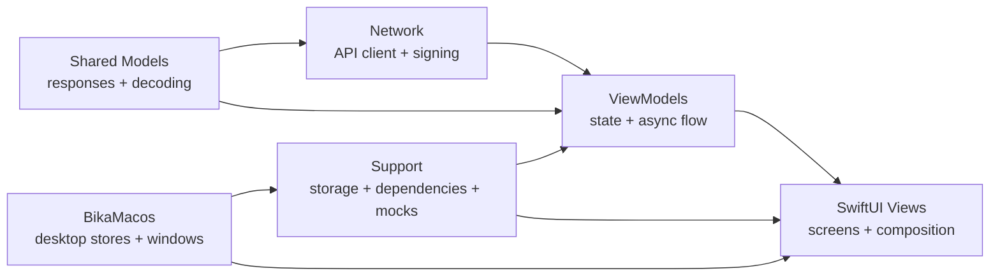

<div align="center">
  <a href="README.zh-CN.md">简体中文</a>
  <br />
  <br />
  
  <h1>Bika</h1>
  <p>
    <strong>A SwiftUI comic reader for iOS and macOS.</strong>
  </p>
  <p>
    Browse, search, read, comment, favourite, and resume progress in one cohesive app flow.
  </p>
  <p>
    <a href="TESTING.md">Testing Guide</a>
    ·
    <a href="CLOUD_HISTORY_SYNC.md">Cloud History Sync</a>
    ·
    <a href="bika项目文档.md">Project Notes</a>
  </p>
  <p>
    
    
    
    
  </p>
</div>

---

## Why Bika

Bika is built around real reading workflows instead of isolated UI demos. It covers the full path from content discovery to long-session reading, then keeps the iOS and macOS experiences aligned where the workflows overlap.

| Reader Experience | Desktop Experience | Engineering Shape |
| --- | --- | --- |
| Category browsing, ranking, search, detail, comments, favourites, history, and progress recovery. | Native macOS sidebar navigation, compact detail panes, independent reader windows, and a singleton comments window. | SwiftUI, `@Observable`, async/await networking, injectable dependencies, shared pagination, and fixture-backed tests. |

## Highlights

| Area | What It Does |
| --- | --- |
| Discovery | Browse categories, rankings, recommendations, tags, authors, and sorted search results with pagination and restoration. |
| Reading | Read with horizontal paging or vertical scrolling, persist chapter/page position, and continue where you left off. |
| Community | Browse comments and child comments, with like and reply actions wired into the app flow. |
| Library | Manage favourites, reading history, theme mode, image quality, and content filtering settings. |
| Cloud Sync | Optionally sync history between iOS and macOS through a private self-hosted HTTPS endpoint. |
| macOS | Use sidebar navigation, reader windows, waterfall reading, touchpad-friendly paging, per-page pinch zoom, and independent comments. |

## Architecture



### Shared Paginated Results

Several list-based pages reuse one pagination model instead of carrying separate state machines in every screen.

- [ComicResultsViewModel.swift](bika/ViewModels/ComicResultsViewModel.swift)
- [PaginatedComicResultsView.swift](bika/Views/Helpers/PaginatedComicResultsView.swift)

### Composed Comic Detail

The detail experience is split into focused sections, keeping metadata, episodes, recommendations, and comment navigation easier to maintain.

- [ComicDetailView.swift](bika/Views/ComicDetailView.swift)
- [ComicDetailSections.swift](bika/Views/ComicDetailSections.swift)

### Reading Continuity

The reader persists chapter and page position so users can return directly to the point where they stopped.

- [ComicReaderView.swift](bika/Views/ComicReaderView.swift)
- [ReadingProgressManager.swift](bika/Views/Helpers/ReadingProgressManager.swift)

### Optional Cloud History Sync

Cloud history sync is disabled by default and stores no server details in the repository. Users configure a private HTTPS endpoint and bearer token locally in iOS/macOS settings. Certificate SHA-256 pinning is optional for Caddy/Let's Encrypt deployments, including DuckDNS or `<VPS_PUBLIC_IP>.sslip.io` hostnames. The companion VPS service stores shared history in SQLite, keeps the newest 200 records, and exposes only the HTTPS API needed by the app.

- [CloudHistorySync.swift](bika/Support/CloudHistorySync.swift)
- [CLOUD_HISTORY_SYNC.md](CLOUD_HISTORY_SYNC.md)

### macOS Target

The macOS app lives in `BikaMacos/` and shares the existing models, networking, dependency setup, and image loading infrastructure with the iOS target. The desktop layer adds stores and views for split navigation, detail panes, settings, history, blocked categories, comments, and independent reader windows.

- [BikaMacosApp.swift](BikaMacos/BikaMacosApp.swift)
- [MacLibraryModel.swift](BikaMacos/Stores/MacLibraryModel.swift)
- [MacReaderWindowView.swift](BikaMacos/Views/MacReaderWindowView.swift)
- [MacComicDetailPane.swift](BikaMacos/Views/MacComicDetailPane.swift)

### Mock-First Dependencies

The app can switch to fixture-backed dependencies for repeatable local and CI verification.

- [AppDependencies.swift](bika/Support/AppDependencies.swift)
- [MockURLProtocol.swift](bika/Support/MockURLProtocol.swift)
- [SmokeFixtureRouter.swift](bika/Support/SmokeFixtureRouter.swift)

## Project Layout

```text
.
├── BikaMacos/              # macOS app source
├── bika/                   # Shared iOS app source
├── bikaTests/              # Unit tests
├── bikaUITests/            # UI smoke tests
├── script/build_and_run.sh # macOS local run/debug helper
├── scripts/test.sh         # Unified local test entry
├── TESTING.md              # Testing guide
├── CLOUD_HISTORY_SYNC.md   # Optional sync service notes
└── bika项目文档.md          # Architecture and maintenance notes
```

Inside `bika/`:

| Directory | Responsibility |
| --- | --- |
| `Models` | Response models and decoding rules. |
| `Network` | Endpoints, API client, signing, and error definitions. |
| `Support` | Dependency setup, mocks, navigation restoration, storage, and helpers. |
| `ViewModels` | Page state, pagination flow, and async business logic. |
| `Views` | Screens and feature composition. |
| `Views/Helpers` | Shared UI, reader support, pagination, and image helpers. |

## Getting Started

### Requirements

| Tool | Version or Destination |
| --- | --- |
| Xcode | `26.5` |
| iOS Simulator | `iPhone 17` |
| macOS destination | `My Mac` |

### Common Commands

```bash
chmod +x ./scripts/test.sh
./scripts/test.sh build-for-testing
./scripts/test.sh unit
./scripts/test.sh ui-smoke
./scripts/test.sh all
./script/build_and_run.sh --verify
```

## Testing And CI

The repository uses mock-first automated tests, so local and CI verification do not require a live backend or real account.

| Layer | Purpose |
| --- | --- |
| Unit | Validate ViewModels, support utilities, decoding, and business logic. |
| UI Smoke | Exercise core navigation and app flows with fixture-backed data. |
| CI | Run `unit` and `ui-smoke` on `push` and `pull_request`. |

More details:

- [TESTING.md](TESTING.md)
- [.github/workflows/ios-tests.yml](.github/workflows/ios-tests.yml)

## Roadmap

- Keep iOS and macOS feature surfaces aligned where user workflows overlap.
- Refine the macOS reader around trackpad, keyboard, and independent-window interactions.
- Migrate more list-style pages onto the shared paginated results pattern.
- Reduce direct singleton usage inside views.
- Expand unit coverage around ViewModels and support utilities.
- Keep critical failure paths visible instead of silently degrading user actions.

## License

No license file is currently included in this repository.
