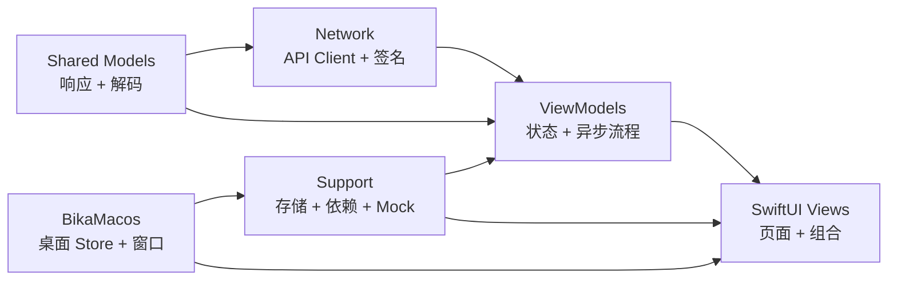

<div align="center">
  <a href="README.md">English</a>
  <br />
  <br />
  
  <h1>Bika</h1>
  <p>
    <strong>一个基于 SwiftUI 的 iOS 与 macOS 漫画阅读项目。</strong>
  </p>
  <p>
    把浏览、搜索、详情、阅读、评论、收藏和进度恢复串成一条完整的使用链路。
  </p>
  <p>
    <a href="TESTING.md">测试说明</a>
    ·
    <a href="CLOUD_HISTORY_SYNC.md">云端历史同步</a>
    ·
    <a href="bika项目文档.md">项目文档</a>
  </p>
  <p>
    
    
    
    
  </p>
</div>

---

## 为什么是 Bika

Bika 不是只展示几个独立页面的 Demo，而是围绕真实阅读流程搭建的完整客户端。它覆盖从发现内容到长时间阅读的核心体验，同时让 iOS 与 macOS 在重叠用户流程上保持一致。

| 阅读体验 | 桌面体验 | 工程形态 |
| --- | --- | --- |
| 分类、排行榜、搜索、详情、评论、收藏、历史记录和阅读进度恢复。 | 原生 macOS 侧边栏、紧凑详情页、独立阅读器窗口和单例评论窗口。 | SwiftUI、`@Observable`、async/await 网络层、可注入依赖、共享分页模式和 fixture 测试。 |

## 功能亮点

| 模块 | 能力 |
| --- | --- |
| 内容发现 | 分类、排行榜、推荐、标签、作者，以及支持排序、分页和恢复的搜索结果。 |
| 阅读器 | 横向翻页与纵向滚动两种阅读模式，持久化章节和页码，支持继续阅读。 |
| 社区 | 评论与子评论浏览，串联点赞和回复动作。 |
| 书架 | 收藏、历史记录、主题模式、图片质量和内容过滤设置。 |
| 云端同步 | 可选的私人云端历史同步，让 iOS 与 macOS 共用自建 HTTPS 服务端。 |
| macOS | 侧边栏导航、独立阅读器窗口、瀑布阅读、触摸板横向翻页、单页双指缩放和独立评论窗口。 |

## 架构概览



### 统一的分页漫画结果模式

多个列表型页面复用同一套分页逻辑，而不是每个页面各自维护一份独立状态机。

- [ComicResultsViewModel.swift](bika/ViewModels/ComicResultsViewModel.swift)
- [PaginatedComicResultsView.swift](bika/Views/Helpers/PaginatedComicResultsView.swift)

### 组合式详情页结构

漫画详情页已经拆成更清晰的分区组合，让元数据、章节、推荐内容和评论入口更容易维护。

- [ComicDetailView.swift](bika/Views/ComicDetailView.swift)
- [ComicDetailSections.swift](bika/Views/ComicDetailSections.swift)

### 阅读恢复与连续性

阅读器会持久化章节和页码位置，用户可以更自然地回到上次中断的位置。

- [ComicReaderView.swift](bika/Views/ComicReaderView.swift)
- [ReadingProgressManager.swift](bika/Views/Helpers/ReadingProgressManager.swift)

### 可选云端历史同步

云端历史同步默认关闭，仓库不会保存服务器地址、Token 或证书 pin。用户可以在 iOS/macOS 设置页本地填写自建 HTTPS 服务端和 Bearer Token 后启用。使用 Caddy/Let's Encrypt 时证书 SHA-256 pin 可留空，主机名可以是 DuckDNS 或 `<VPS_PUBLIC_IP>.sslip.io`，只有自签名证书才需要填写。配套 VPS 服务会把共享历史记录写入 SQLite 历史库，只保留最新 200 条，并且只暴露 App 需要的 HTTPS API。

- [CloudHistorySync.swift](bika/Support/CloudHistorySync.swift)
- [CLOUD_HISTORY_SYNC.md](CLOUD_HISTORY_SYNC.md)

### macOS Target

macOS 应用代码位于 `BikaMacos/`，复用现有模型、网络层、依赖装配和图片加载基础设施。桌面层增加了 macOS 专用的 store 与 view，用于 split navigation、详情页、设置、阅读历史、屏蔽分类、评论以及独立阅读器窗口。

- [BikaMacosApp.swift](BikaMacos/BikaMacosApp.swift)
- [MacLibraryModel.swift](BikaMacos/Stores/MacLibraryModel.swift)
- [MacReaderWindowView.swift](BikaMacos/Views/MacReaderWindowView.swift)
- [MacComicDetailPane.swift](BikaMacos/Views/MacComicDetailPane.swift)

### 可注入依赖与 Mock 测试

应用支持切换到基于 fixture 的依赖配置，方便本地和 CI 做稳定、可重复的验证。

- [AppDependencies.swift](bika/Support/AppDependencies.swift)
- [MockURLProtocol.swift](bika/Support/MockURLProtocol.swift)
- [SmokeFixtureRouter.swift](bika/Support/SmokeFixtureRouter.swift)

## 项目结构

```text
.
├── BikaMacos/              # macOS 应用源代码
├── bika/                   # iOS 与共享应用源代码
├── bikaTests/              # 单元测试
├── bikaUITests/            # UI Smoke 测试
├── script/build_and_run.sh # macOS 本地运行/调试入口
├── scripts/test.sh         # 统一本地测试入口
├── TESTING.md              # 测试说明
├── CLOUD_HISTORY_SYNC.md   # 可选同步服务说明
└── bika项目文档.md          # 架构与维护说明
```

`bika/` 目录内部按职责划分：

| 目录 | 职责 |
| --- | --- |
| `Models` | 响应模型与解码规则。 |
| `Network` | 接口定义、API Client、签名与错误类型。 |
| `Support` | 依赖注入、Mock、导航恢复、存储与辅助能力。 |
| `ViewModels` | 页面状态、分页流程与异步业务逻辑。 |
| `Views` | 页面与功能组合。 |
| `Views/Helpers` | 共享 UI、阅读器辅助、分页与图片相关能力。 |

## 快速开始

### 环境要求

| 工具 | 版本或目标 |
| --- | --- |
| Xcode | `26.5` |
| iOS Simulator | `iPhone 17` |
| macOS 运行目标 | `My Mac` |

### 常用命令

```bash
chmod +x ./scripts/test.sh
./scripts/test.sh build-for-testing
./scripts/test.sh unit
./scripts/test.sh ui-smoke
./scripts/test.sh all
./script/build_and_run.sh --verify
```

## 测试与 CI

当前仓库默认使用 mock-first 自动化测试，本地和 CI 验证都不依赖真实后端或真实账号。

| 层级 | 作用 |
| --- | --- |
| Unit | 验证 ViewModel、Support 工具、解码与业务逻辑。 |
| UI Smoke | 使用 fixture 数据覆盖核心导航与应用流程。 |
| CI | 在 `push` 和 `pull_request` 上执行 `unit` 与 `ui-smoke`。 |

更多说明见：

- [TESTING.md](TESTING.md)
- [.github/workflows/ios-tests.yml](.github/workflows/ios-tests.yml)

## 后续维护方向

- 保持 iOS 与 macOS 在重叠用户流程上的功能对齐。
- 继续围绕触摸板、键盘和独立窗口优化 macOS 阅读器。
- 继续把更多列表型页面迁到统一的分页结果模式。
- 继续减少在 View 中直接扩散共享单例。
- 持续补强 ViewModel 与 Support 层的单元测试。
- 让关键失败路径保持可见，而不是静默降级。

## License

当前仓库尚未包含许可证文件。
